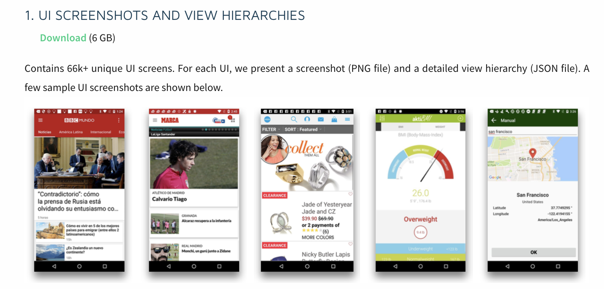
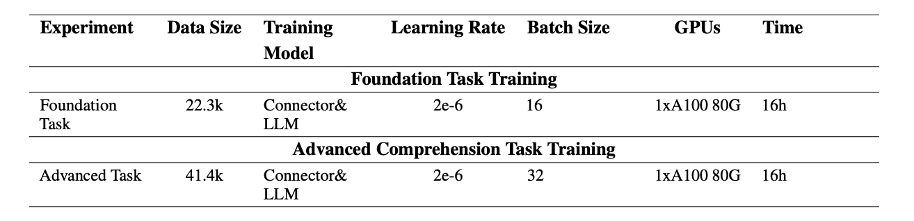
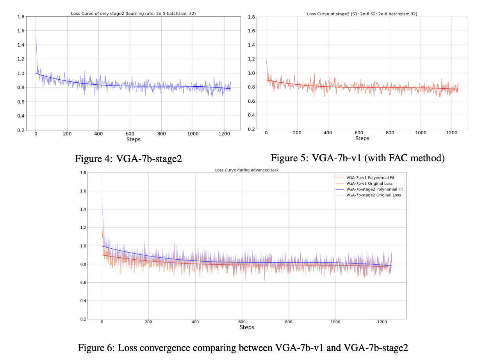
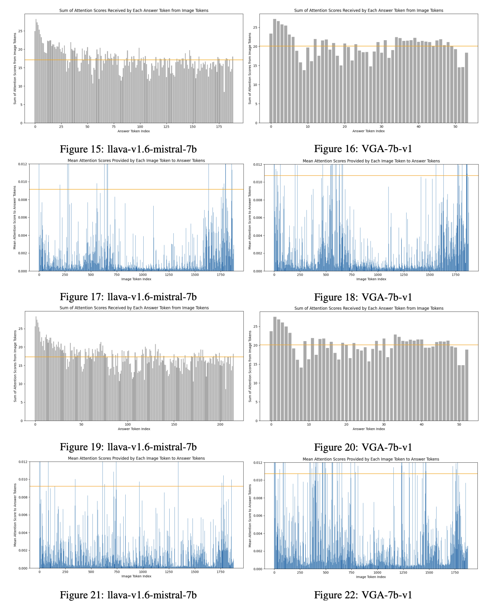
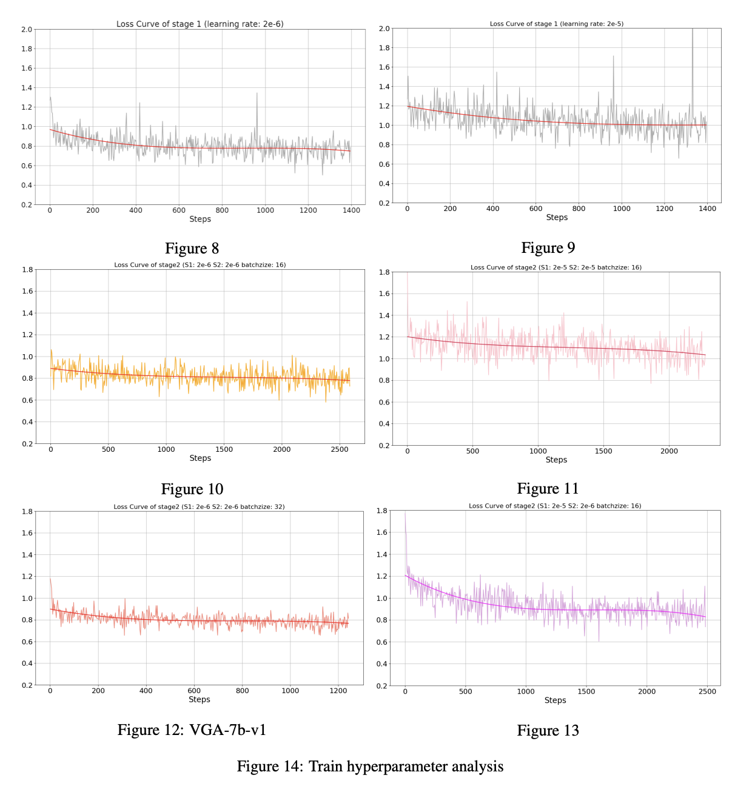

# VGA-visual-GUI-assistant
---
### Release
- We release our dataset to ensure that everyone can replicate our experimental conclusions.

### Directory Description
      |-- dataset generate / method(prompts) to generate data
    --|-- dataset          / data resource
      |-- llava training   / training code
      |-- tuning script    / tuing parameters

### Setup
#### Dataset Format
Our dataset follow the format of llava training data.

    ```
    [
        {
        "id": "location/0000002",
        "image": "location/0000002.jpg",
        "conversations": [
            {
                "from": "human",
                "value": "<image>\nAnalyze all the button UI on this page."
            },
            {
                "from": "gpt",
                "value": "On this page, there are several UI buttons located at different positions. \n\nThe first button is near the top section of the page. It has the text \"1990\" and is clickable. The button is positioned towards the center of the page, slightly closer to the left side. \n\nThe second button is also located near the top section. It displays the text \"Fri, Jun 15\" and is clickable as well. This button is positioned to the right of the previous button, closer to the center-right section of the page.\n\nMoving downwards, there are three more buttons.\n\nThe third button, labeled as \"Prev,\" is positioned in the middle section of the page. It is an image button and has no visible text. This button is closer to the left side of the page, slightly below the center.\n\nThe fourth button, labeled as \"Next,\" is located beside the previous button in the middle section of the page. Similar to the previous button, it is an image button and has no visible text. This button is placed closer to the right side of the page, slightly below the center.\n\nFinally, there is a button with the text \"Done\" positioned in the lower section of the page. It is a regular button and is clickable. This button is situated towards the right side of the lower section.\n\nIn summary, there are five buttons present on this page in total. They are distributed across different sections of the page, with the two text buttons at the top, followed by two image buttons in the middle, and one regular button at the bottom-right corner."
            }
        ]
    },
    ]
    ```
#### Rico Dataset

You can download images data from http://www.interactionmining.org/rico.html


After download the Rico dataset, make sure each image name follow the format ``"image": "0028594.jpg"``

#### parameter



#### Training

To use this data trian you own model, make sure follow the steps bellow.

- Download llava using 
    ```
    git clone https://github.com/haotian-liu/LLaVA.git 
    ```
- Download Rico dataset 

- Download llava-v1.6-mistral-7b
    ```
    git clone https://huggingface.co/liuhaotian/llava-v1.6-mistral-7b
    ```
- Replace train.py in LLaVA/llava/train/ with llava training/train.py
- Replace scripts in  LLaVA/scripts

##### foundation training
Add you own model path, data path, and image path in scripts
make sure you are using ins.json
```
    --model_name_or_path liuhaotian/llava-v1.6-mistral-7b \
    --version mistral_instruct \
    --data_path ../../rico/dataset/conv2.json \
    --image_folder ../../rico/images \
    --output_dir ./checkpoints/VGA-7b-ins-v1 \
```

##### advanced training 
Add you foundation model path and data path  
make sure you are using conv2.json
```
    --model_name_or_path ./checkpoints/VGA-7b-ins-v1 \
    --version mistral_instruct \
    --data_path conv2.json \
    --image_folder ../../rico/images \
```

### Result
##### training loss

##### attetion distribution

##### hyperparameter



